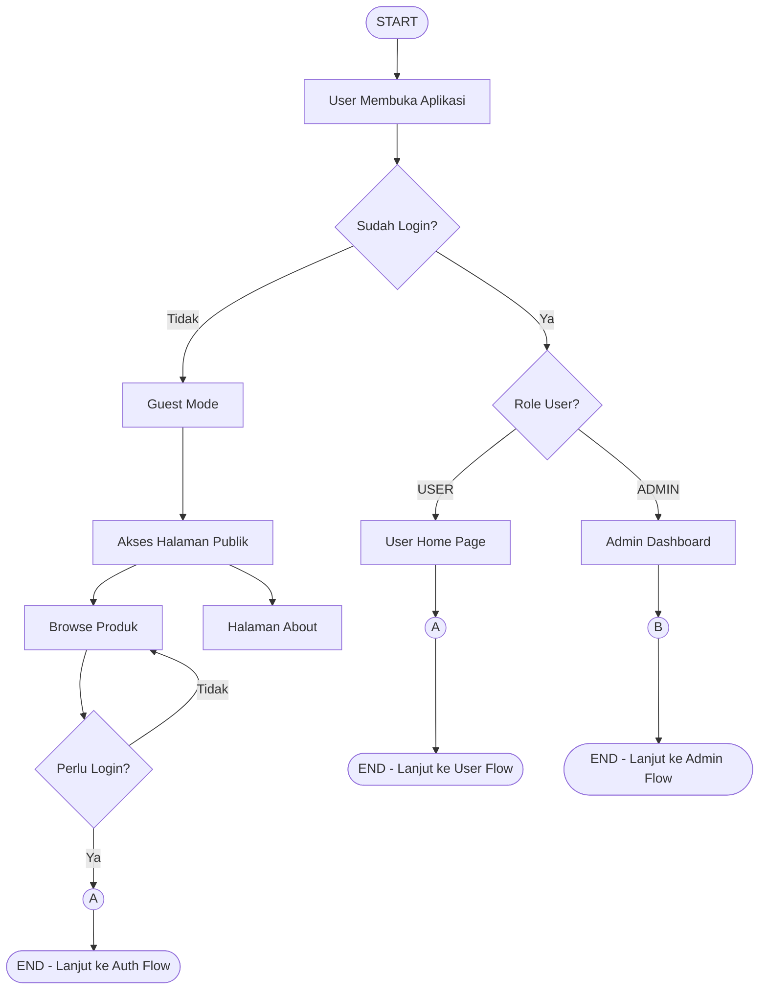
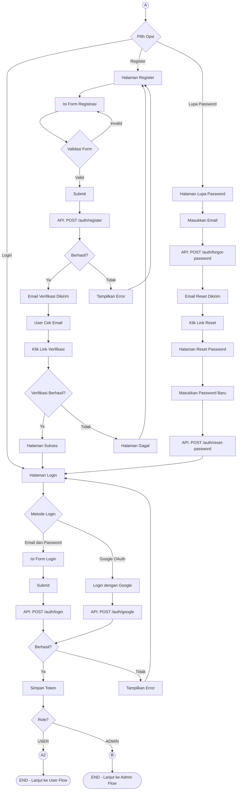
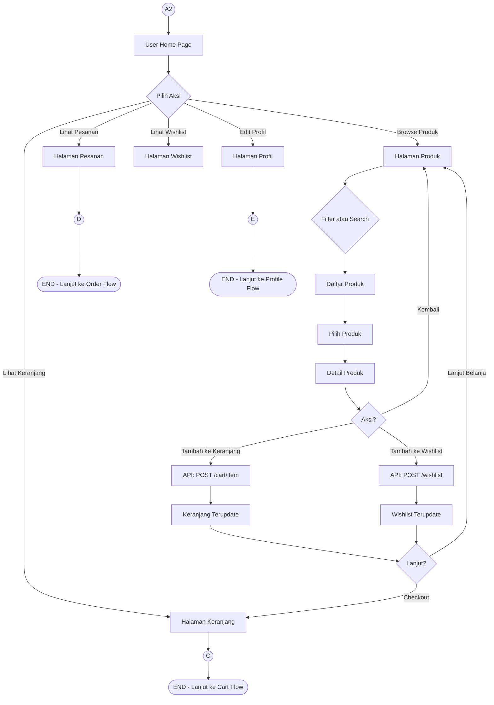
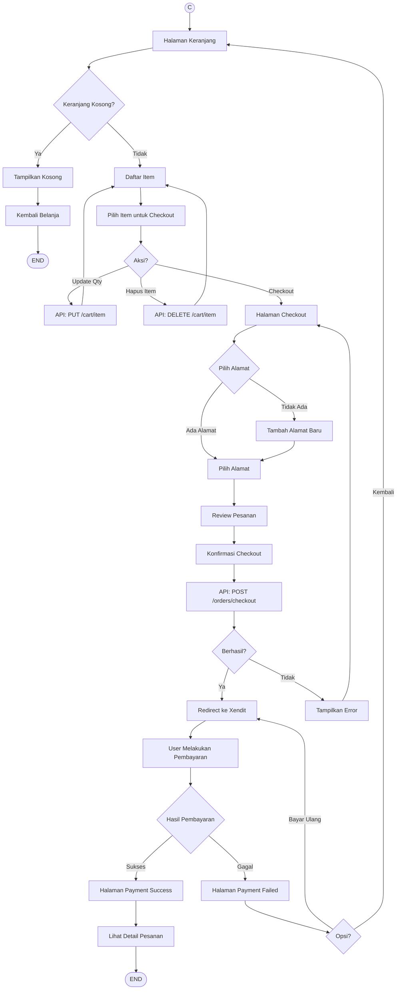
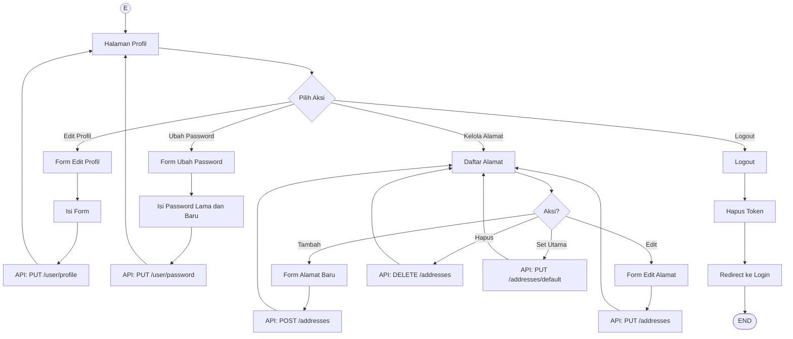
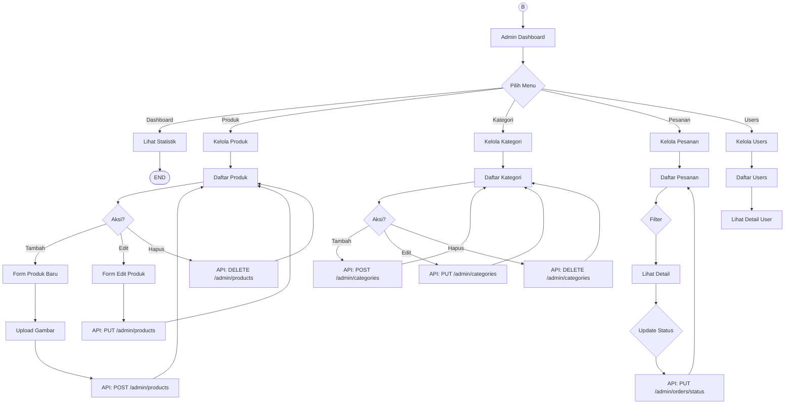

# Greeceri Store - Complete Application Flowchart

Flowchart lengkap aplikasi Greeceri Store yang bisa langsung di-copy ke Mermaid.

---

## 🔄 Main Application Flow

---

## 🔐 A - Authentication Flow

---

## 👤 A2 - User Shopping Flow

---

## 🛒 C - Cart dan Checkout Flow

---

## 📦 D - Order Management Flow

```mermaid
flowchart TD
    ORDER_START((D)) --> ORDER_LIST[Halaman Riwayat Pesanan]

    ORDER_LIST --> ORDER_FILTER{Filter Status}
    ORDER_FILTER --> FILTERED_LIST[Daftar Pesanan]

    FILTERED_LIST --> SELECT_ORDER[Pilih Pesanan]
    SELECT_ORDER --> ORDER_DETAIL[Detail Pesanan]

    ORDER_DETAIL --> ORDER_STATUS{Status Pesanan?}

    ORDER_STATUS -->|PENDING PAYMENT| PENDING_ACT{Aksi?}
    PENDING_ACT -->|Bayar| PAY_NOW[Redirect ke Payment]
    PENDING_ACT -->|Batalkan| CANCEL_ORDER["API: PUT /orders/cancel"]

    ORDER_STATUS -->|PROCESSING| WAIT_SHIP[Menunggu Pengiriman]
    ORDER_STATUS -->|SHIPPED| SHIPPED_ACT{Aksi?}
    SHIPPED_ACT -->|Konfirmasi Terima| CONFIRM_RECV["API: PUT /orders/confirm-delivery"]

    ORDER_STATUS -->|DELIVERED| COMPLETED[Pesanan Selesai]
    ORDER_STATUS -->|CANCELLED| CANCELLED[Pesanan Dibatalkan]

    PAY_NOW --> PAYMENT_C((C))
    CANCEL_ORDER --> ORDER_LIST
    CONFIRM_RECV --> COMPLETED

    COMPLETED --> END_ORDER([END])
    CANCELLED --> END_ORDER
    PAYMENT_C --> END_PAY([END - Ke Payment Flow])
```

---

## 👤 E - Profile Management Flow

---

## 👨‍💼 B - Admin Flow

---

## 📋 Legend

| Symbol         | Keterangan        |
| -------------- | ----------------- |
| `([START])`    | Titik awal        |
| `([END])`      | Titik akhir       |
| `((A))`        | On-page connector |
| `{Decision}`   | Decision/kondisi  |
| `[Process]`    | Proses/aksi       |
| `["API: ..."]` | API Call          |
