# Greeceri Store - Application Flowchart

## 📊 User Flow Overview

```mermaid
flowchart TD
    subgraph Public["🌐 Public Pages"]
        HOME[Home Page]
        PRODUCTS[Product List]
        DETAIL[Product Detail]
        ABOUT[About Us]
    end

    subgraph Auth["🔐 Authentication"]
        LOGIN[Login]
        REGISTER[Register]
        FORGOT[Forgot Password]
        RESET[Reset Password]
        VERIFY_SUCCESS[Verification Success]
        VERIFY_FAIL[Verification Failed]
        GOOGLE[Google OAuth]
    end

    subgraph User["👤 User Features"]
        CART[Cart]
        CHECKOUT[Checkout]
        PAYMENT[Payment - Xendit]
        PAY_SUCCESS[Payment Success]
        PAY_FAIL[Payment Failed]
        ORDERS[Order History]
        ORDER_DETAIL[Order Detail]
        WISHLIST[Wishlist]
        PROFILE[Profile]
        ADDRESSES[Addresses]
    end

    subgraph Admin["👨‍💼 Admin Panel"]
        DASHBOARD[Dashboard]
        ADMIN_PRODUCTS[Manage Products]
        ADMIN_CATEGORIES[Manage Categories]
        ADMIN_ORDERS[Manage Orders]
        ADMIN_USERS[Manage Users]
    end

    %% Public Flow
    HOME --> PRODUCTS
    HOME --> ABOUT
    PRODUCTS --> DETAIL
    DETAIL --> CART

    %% Auth Flow
    LOGIN --> |Success| HOME
    LOGIN --> |Google| GOOGLE
    GOOGLE --> HOME
    REGISTER --> |Email Sent| VERIFY_SUCCESS
    REGISTER --> |Failed| VERIFY_FAIL
    FORGOT --> RESET

    %% User Shopping Flow
    CART --> CHECKOUT
    CHECKOUT --> PAYMENT
    PAYMENT --> |Success| PAY_SUCCESS
    PAYMENT --> |Failed| PAY_FAIL
    PAY_SUCCESS --> ORDER_DETAIL
    PAY_FAIL --> CART

    %% User Account
    PROFILE --> ADDRESSES
    DETAIL --> WISHLIST

    %% Admin Flow
    DASHBOARD --> ADMIN_PRODUCTS
    DASHBOARD --> ADMIN_CATEGORIES
    DASHBOARD --> ADMIN_ORDERS
    DASHBOARD --> ADMIN_USERS
```



---

## 🔐 Authentication Flow

```mermaid
flowchart LR
    A[User] --> B{Has Account?}
    B -->|No| C[Register Page]
    B -->|Yes| D[Login Page]
    
    C --> E[Fill Form]
    E --> F[Submit]
    F --> G[API: POST /auth/register]
    G --> H[Email Verification Sent]
    H --> I[Click Email Link]
    I --> J{Verification}
    J -->|Success| K[/verification-success]
    J -->|Failed| L[/verification-failure]
    K --> D
    
    D --> M{Login Method}
    M -->|Email/Password| N[API: POST /auth/login]
    M -->|Google| O[Google OAuth]
    O --> P[API: POST /auth/google]
    
    N --> Q{Role?}
    P --> Q
    Q -->|USER| R[Home Page]
    Q -->|ADMIN| S[Admin Dashboard]
```

---

## 🛒 Shopping Flow

```mermaid
flowchart TD
    A[Browse Products] --> B[Product List]
    B --> C{Filter/Search}
    C --> D[View Product Detail]
    
    D --> E{User Action}
    E -->|Add to Cart| F[Cart Context Update]
    E -->|Add to Wishlist| G[Wishlist API]
    
    F --> H[Cart Page]
    H --> I[Select Items]
    I --> J[Checkout Page]
    
    J --> K[Select Address]
    K --> L[Review Order]
    L --> M[API: POST /orders/checkout]
    
    M --> N[Xendit Payment Page]
    N --> O{Payment Result}
    O -->|Success| P[/payment-success]
    O -->|Failed| Q[/payment-failure]
    
    P --> R[Order Detail Page]
    Q --> H
```

---

## 📦 Order Management Flow


---

## 🗂️ Page Structure

```mermaid
flowchart TD
    subgraph Routes["Route Structure"]
        ROOT["/"]
        
        %% Public
        ROOT --> HOME[Home]
        ROOT --> ABOUT[/about]
        ROOT --> PRODUCTS[/products]
        PRODUCTS --> PRODUCT_DETAIL[/products/:id]
        
        %% Auth
        ROOT --> LOGIN[/login]
        ROOT --> REGISTER[/register]
        ROOT --> FORGOT[/forgot-password]
        ROOT --> RESET[/reset-password]
        ROOT --> VERIFY_OK[/verification-success]
        ROOT --> VERIFY_FAIL[/verification-failure]
        ROOT --> PAY_OK[/payment-success]
        ROOT --> PAY_FAIL[/payment-failure]
        
        %% Protected User
        ROOT --> CART[/cart]
        ROOT --> CHECKOUT[/checkout]
        ROOT --> ORDERS[/orders/my]
        ORDERS --> ORDER_DETAIL[/orders/my/:id]
        ROOT --> WISHLIST[/wishlist]
        ROOT --> USER[/user]
        USER --> PROFILE[/user/profile]
        USER --> EDIT_PROFILE[/user/edit]
        USER --> PASSWORD[/user/change-password]
        USER --> ADDRESSES[/user/addresses]
        
        %% Admin
        ROOT --> ADMIN[/admin]
        ADMIN --> ADMIN_DASH[Dashboard]
        ADMIN --> ADMIN_PROD[/admin/products]
        ADMIN --> ADMIN_CAT[/admin/categories]
        ADMIN --> ADMIN_ORD[/admin/orders]
        ADMIN --> ADMIN_USR[/admin/users]
    end
```

---

## 🔄 State Management


---

## 📱 Component Hierarchy


